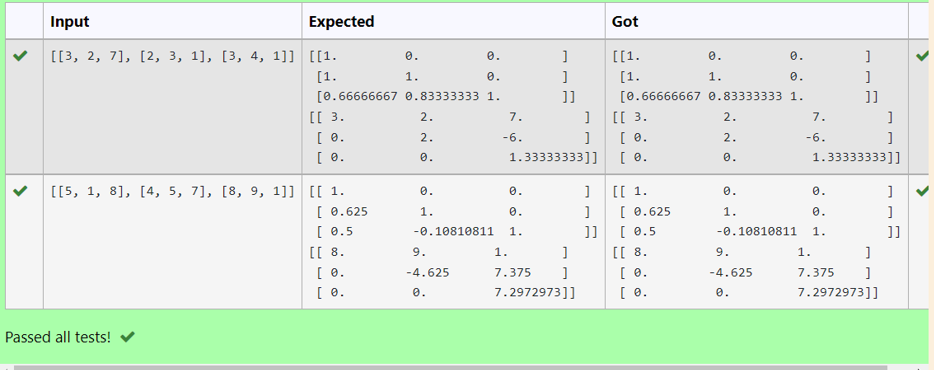
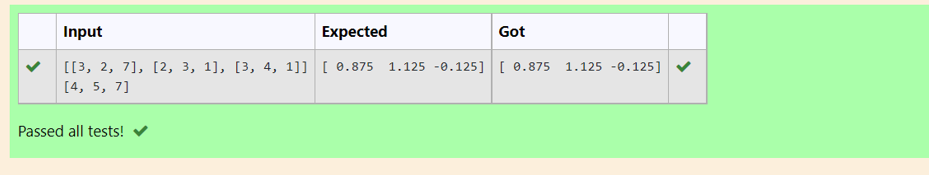

# LU Decomposition without zero on the diagonal

## AIM:
To write a program to find the LU Decomposition of a matrix.

## Equipments Required:
1. Hardware – PCs
2. Anaconda – Python 3.7 Installation / Moodle-Code Runner

## Algorithm
1. import numpy as np
2. import scipy.linalg import lu
3. get an input
4. print L and print U

## Program
~~~
/*
Program to find L and U matrix using LU decomposition.
Developed by: LAKSHMI PRIYA.P
RegisterNumber: 21001411

# To print L and U matrix
import numpy as np
from scipy.linalg import lu
A = np.array(eval(input()))
P, L, U = lu(A)
print(L)
print(U)
*/
~~~

## Output:

## Result:
Thus the program to find the LU Decomposition of a matrix is written and verified using python programming.

# LU Decomposition without zero on the diagonal

## AIM:
To write a program to find the LU Decomposition of a matrix.

## Equipments Required:
1. Hardware – PCs
2. Anaconda – Python 3.7 Installation / Moodle-Code Runner

## Algorithm
1. import numpy as np
2. import scipy.linalg import lu
3. get an input
4. print L and print U

~~~
/*
Program to solve a matrix using LU decomposition.
Developed by: LAKSHMI PRIYA.P
RegisterNumber: 21001411

# To print X matrix (solution to the equations)
import numpy as np
from scipy.linalg import lu_factor, lu_solve
A = np.array(eval(input()))
B = np.array(eval(input()))
lu, pivot = lu_factor(A)
x = lu_solve((lu,pivot),B)
print(x)
*/
~~~

## Output:

## Result:
Thus the program to find the LU Decomposition of a matrix is written and verified using python programming.

